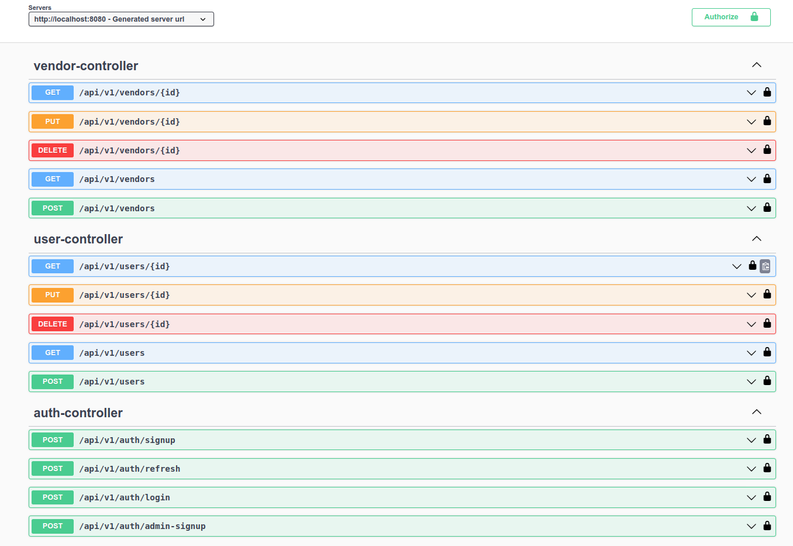

# Running the program

## Using Docker
```
docker-compose up --build
```
## Access the Swagger API Documentation
```
http://localhost:8080/swagger-ui/index.html
```
<p align="center">
  
</p>

## You must sign up or login first before you can access other APIs.
